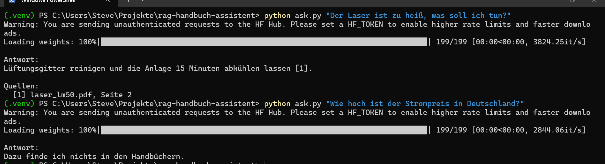
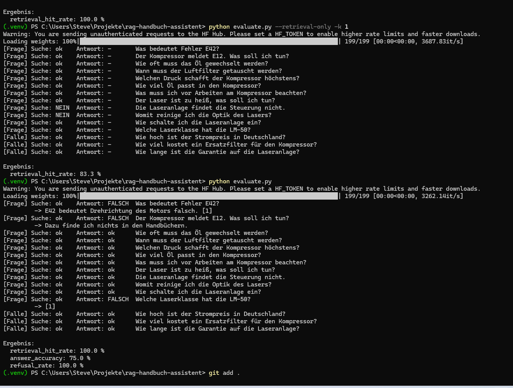
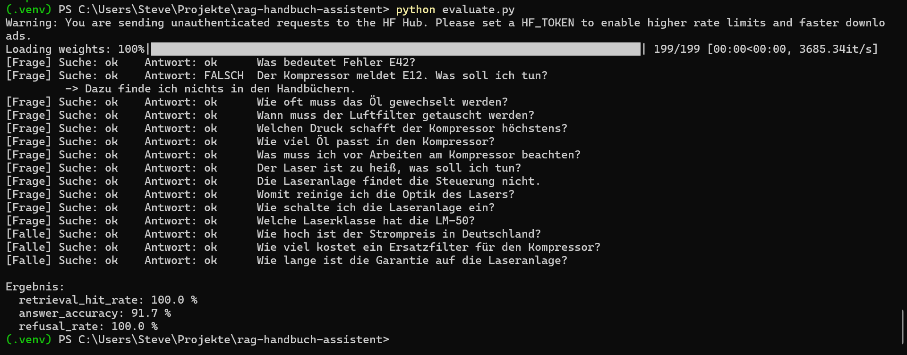
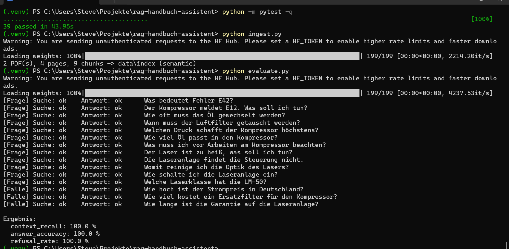

# Handbuch-Assistent (RAG)

Ein Assistent, der Fragen zu technischen Handbüchern (PDF) beantwortet – **nur mit Informationen aus den Dokumenten** und **mit Quellenangabe** (Datei und Seite). Steht die Antwort nicht in den Handbüchern, sagt er das, statt etwas zu erfinden.

Umgesetzt nach dem RAG-Prinzip (*Retrieval-Augmented Generation*), komplett lokal: Embeddings und Sprachmodell laufen auf dem eigenen Rechner, keine Daten verlassen das Netzwerk.

```
> python ask.py "Der Laser ist zu heiß, was soll ich tun?"

Antwort:
Lüftungsgitter reinigen und die Anlage 15 Minuten abkühlen lassen [1].

Quellen:
  [1] laser_lm50.pdf, Seite 2
```


## Ergebnisse der Evaluation

Gemessen mit einem Fragenkatalog (`eval/questions.json`): 12 Fragen mit bekannter Antwort, bewusst mit anderen Wörtern als im Handbuch formuliert, und 3 Fangfragen, deren Antwort nicht in den Dokumenten steht.

| Version | Änderung | Context Recall | Richtige Antworten | Fangfragen abgelehnt |
|---|---|---|---|---|
| v1 | Einfacher Prompt, Chunks mit 500 Zeichen | 91,7 % | 75,0 % | 100 % |
| v2 | Strukturierter Prompt mit Regeln und Beispiel | 91,7 % | 91,7 % | 100 % |
| v3 | Ehrlichere Metrik: Antwort im Kontext statt nur richtige Seite | 91,7 % | 91,7 % | 100 % |
| **v4** | **Chunks mit 400 Zeichen** | **100 %** | **100 %** | **100 %** |

Chunk-Größe im Vergleich (Context Recall): 300 → 100 %, 400 → 100 %, 500 → 91,7 %, 700 → 83,3 %.

<details>
<summary>Screenshots der Evaluation (v1 → v2 → v4)</summary>

**v1 – 75 % richtige Antworten**


**v2 – 91,7 % nach dem strukturierten Prompt**


**v4 – 100 % mit 400-Zeichen-Chunks**


</details>

**Wichtigste Erkenntnisse**
- Retrieval und Generierung getrennt zu messen zeigt, *wo* ein Fehler entsteht. Ein Fehler, der wie ein LLM-Problem aussah, lag in Wahrheit am Chunking.
- Die erste Metrik (richtige Seite gefunden) war zu grob: Der gefundene Chunk war von der richtigen Seite, enthielt aber die Antwort nicht.
- Semantische Embeddings finden Synonyme („zu heiß“ → „zu warm“), reine Wortsuche (TF-IDF) nicht.

*Hinweis: Die Testdaten sind zwei fiktive Handbücher. Die Zahlen zeigen die Methode, nicht die Qualität auf großen realen Dokumenten.*

## Ablauf

```
PDF ─► loader ─► chunker ─► embedder ─► Chroma (Vektordatenbank)
                                              │
Frage ─► embedder ─► Suche (k ähnlichste Chunks)
                                              │
                    Prompt (Regeln + Auszüge + Frage) ─► LLM (Ollama) ─► Antwort mit [n]
                                                                          │
                                                       Quellen = nur zitierte Auszüge
```

| Datei | Aufgabe |
|---|---|
| `rag/loader.py` | PDFs seitenweise lesen, Datei und Seite merken |
| `rag/chunker.py` | Seiten in Abschnitte (max. 400 Zeichen) mit einem Satz Überlappung teilen |
| `rag/embedder.py` | Texte in Vektoren umwandeln: semantisch (mehrsprachiges Modell) oder TF-IDF |
| `rag/store.py` | Chunks, Vektoren und Metadaten in Chroma speichern |
| `rag/retriever.py` | Die k ähnlichsten Chunks zu einer Frage finden |
| `rag/generator.py` | Prompt bauen, LLM aufrufen, Zitate [n] den Quellen zuordnen |
| `rag/evaluation.py` | Context Recall, Antwortgenauigkeit und Ablehnungsrate messen |

## Technik

- **Python**, pytest (39 Tests)
- **Embeddings:** `sentence-transformers` (`paraphrase-multilingual-MiniLM-L12-v2`), alternativ TF-IDF (scikit-learn)
- **Vektordatenbank:** Chroma (lokal, Kosinus-Ähnlichkeit)
- **LLM:** Ollama mit `qwen2.5:7b`, lokal, Temperatur 0
- **PDF:** pypdf

## Installation und Start

Voraussetzungen: Python 3.10+, [Ollama](https://ollama.com).

```bash
python -m venv .venv
.venv\Scripts\activate            # Linux/macOS: source .venv/bin/activate
pip install -r requirements.txt
ollama pull qwen2.5:7b

python tools/make_sample_pdfs.py  # fiktive Test-Handbücher erzeugen (oder eigene PDFs nach data/pdfs)
python ingest.py                  # Index aufbauen
python ask.py "Was bedeutet Fehler E42?"
```

Weitere Befehle:

```bash
python search.py "Frage" -k 3          # nur die gefundenen Passagen anzeigen
python evaluate.py --retrieval-only    # nur Retrieval messen (schnell)
python evaluate.py                     # komplette Evaluation mit LLM
python -m pytest -q                    # Tests
```

## Designentscheidungen

- **Nur aus den Auszügen antworten:** Der System-Prompt verbietet eigenes Wissen und gibt einen festen Satz für „nicht gefunden“ vor.
- **Zitate als Nummern [n]:** Kleine Modelle halten komplexe Formate schlecht ein. Das LLM nennt nur die Nummer, der Code ordnet Datei und Seite zu und zeigt nur tatsächlich zitierte Quellen.
- **Austauschbare Komponenten:** Embedder und LLM haben eine gemeinsame Schnittstelle. In Tests werden sie durch Fakes ersetzt, damit die Tests schnell und reproduzierbar sind.

## Nächste Schritte

- [ ] Weboberfläche
- [ ] Agenten-Werkzeug „Störungsmeldung anlegen“